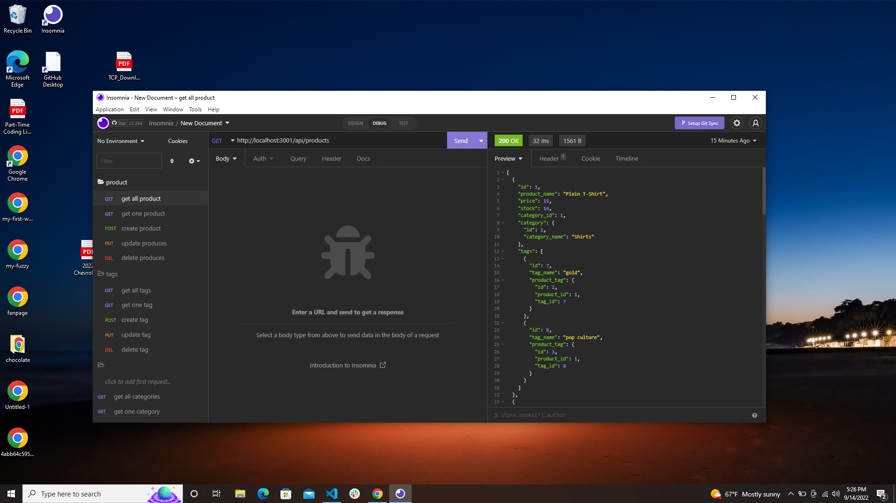
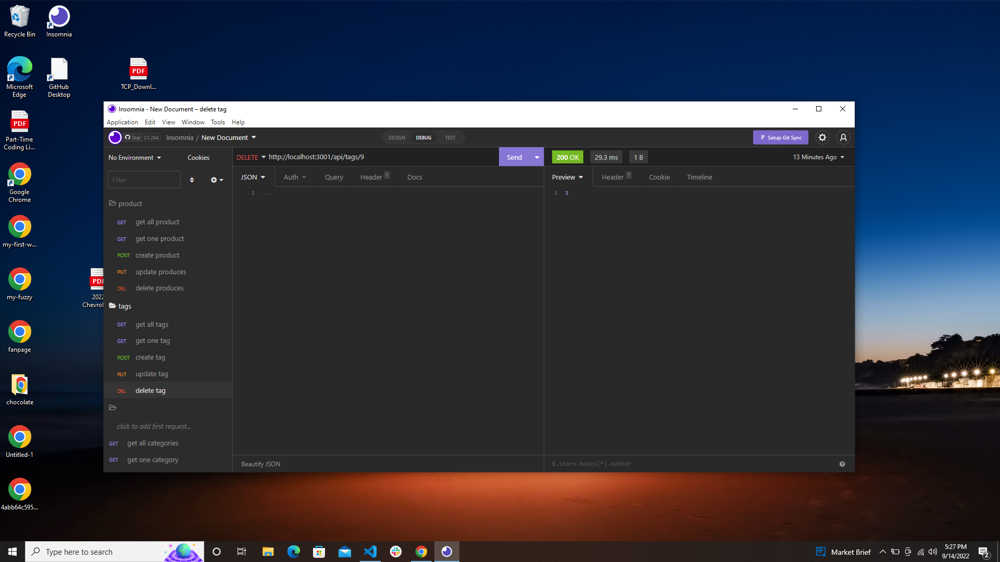

[Link](https://drive.google.com/file/d/1Bv8CJTgXkL0QeBjwm6xYdXPGq2-UjMKg/view)

# Object-Relational Mapping (ORM): E-Commerce Back End

## Description

E-commerce platforms provide a suite of services to businesses of all sizes. I build the back end for an e-commerce site
by modifying starter code. I configured a working Express.js API to use Sequelize to interact with a MySQL database.

I also provided a link to a walkthrough video that demonstrates its functionality to the readme of my project.

## Uses

The user as a manager at an internet retail companywant's a back end for his or her e-commerce website
that uses the latest technologies, so that the company can compete with other e-commerce companies.a
functional Express.js API.when the user add the database name, MySQL username, and MySQL password to an
environment variable file then the user able to connect to a database using Sequelize.when the user enter
schema and seed commands.then a development database is created and is seeded with test data.when the
user enter the command to invoke the application.hen the user server is started and the Sequelize models
are synced to the MySQL database. when the user open API GET routes in Insomnia for categories, products,
or tags. then the data for each of these routes is displayed in a formatted JSON.when the user test API
POST, PUT, and DELETE routes in Insomnia. then the user able to successfully create, update, and delete
data in my database
